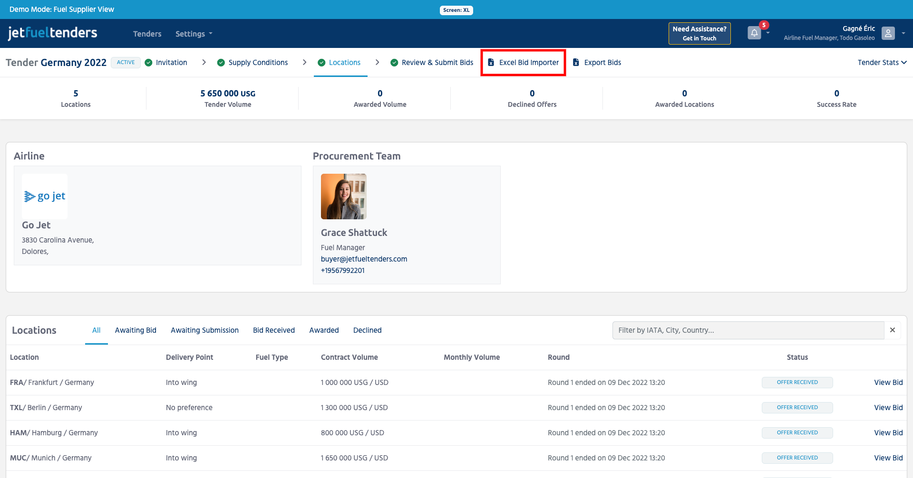

########################
`Import bids from Excel`
########################

JetFueltenders.com have updared the tender importer to simplify the bid import process. User no longer need to reference external code resources. All selectable optaions are now selectable from the dropdown menus.

To begin bid submission using an Excel uploder:

#. Go to the tender invitation page
#. From the Tender menu select Excel Bid Importer

#. From the Tender menu select Excel Bid Importer
   JetFuelTenders will generate a customised template with tender
   information
#. Open the downloaded Excel file
   This file contains multiple sheets. Bids are entered in the following
   three sheets:

   -  Locations
   -  Volume Base Fees & Taxes
   -  Per Usage Base Fees & Taxes

#. Go to the Locations sheet
   Complete all mandatory fields in this sheet. Use the below
   information to reference the input format.
#. Go to the Volume Base Fees & Taxes
   Input any related fees and taxes for each specific locaiton. One fee
   or tax per row
#. Go to the Per Usage Base Fees & Taxes
   Input any related fees and taxes for each specific locaiton. One fee
   or tax per row
#. When ready, save the Excel document and upload it to
   JetFuelTenders.com by clickin on the Import button on the tender page
   or send this document to the airline via emails.

.. raw:: html

    

        <iframe src="https://www.youtube.com/embed/YFDZ59kDuvE" frameborder="0" allowfullscreen style="position: absolute; top: 0; left: 0; width: 100%; height: 100%;"></iframe>
    

The goal of JetFuelTenders.com is to allow airlines and fuel suppliers to run digital tenders without the need for exchanging data via email by sending over spreadsheets. We understand, however, that many suppliers have their own internal database which automatically generates fuel price offers.

If your company's database can transmit your bid data via a spreadsheet, an XML file, or via an API data-feed, then it is possible to integrate with JetFuelTenders.com and automate the transmission of your offers into the JetFuelTenders.com platform.

The process requires a one-time configuration and basic understanding of Excel.

The goal of JetFuelTenders.com is to allow airlines and fuel suppliers to run digital tenders without the need for exchanging data via email using spreadsheets. We understand, however, that many suppliers have their own internal database which automatically generates fuel price offers.

If your company's database can transmit your bid data via a spreadsheet, an XML file, or via an API data-feed, then it is possible to integrate with JetFuelTenders.com and automate the transmission of your offers into the JetFuelTenders.com platform.

The process requires a one-time configuration and a strong knowledge of excel.  I would be happy to set up a one-on-one session with you or your technical team to walk you through this process.

**In this video, I will show you how to upload your offers via an excel file.**

This document is based on IATA XML Tender / Bid Fuel Data Standard.

.. raw:: html

    

        <iframe src="https://www.youtube.com/embed/YFDZ59kDuvE" frameborder="0" allowfullscreen style="position: absolute; top: 0; left: 0; width: 100%; height: 100%;"></iframe>
    

.. toctree::
   :maxdepth: 1

    Locations Sheet <import-excel-locations.rst>
    Volume Base Fees & Taxes Sheet <import-excel-volume-fees.rst>
    Per Usage Base Fees & Taxes Sheet <import-excel-usage-fees.rst>
